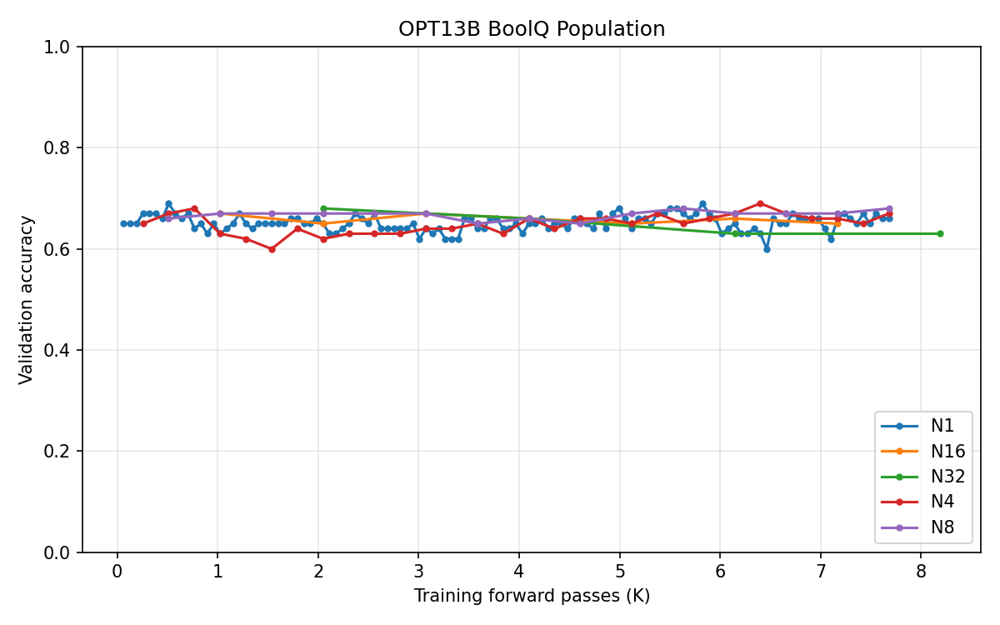
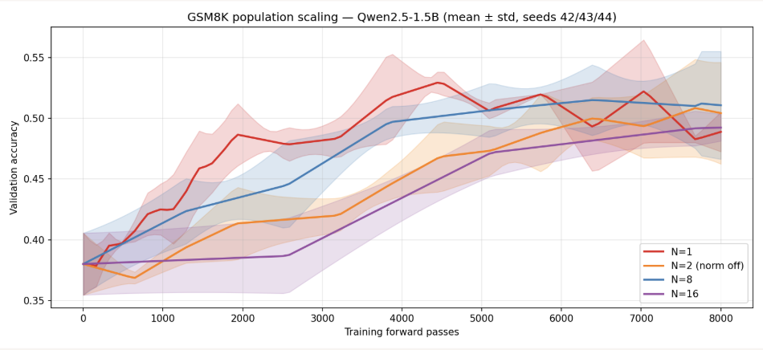
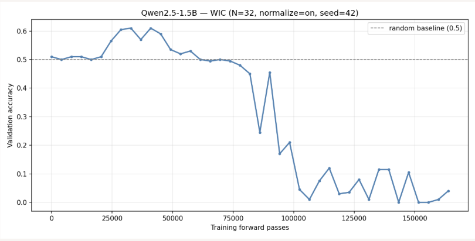
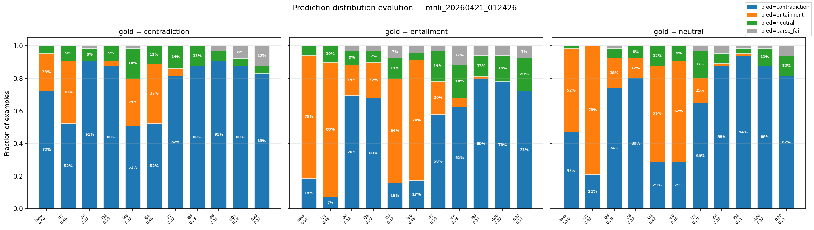

# What Determines the Success and Failure of Evolutionary Strategies in LLM Fine-Tuning?

**Sung Cho, Gyubin Han, Maxwell Delorenzo**  
STAT 4830 — University of Pennsylvania, Spring 2026

---

## Abstract

Evolutionary strategies (ES) have emerged as a compelling approach for fine-tuning large language models (LLMs) — memory-efficient, distributable, and compatible with non-differentiable rewards. Yet despite a shared algorithmic skeleton, published work reports wildly divergent conclusions: some papers find that a population of $N=1$ suffices; others require $N \approx 30$. We identify three factors that jointly explain this disagreement. First, the reward function determines whether population size matters at all: cross-entropy reward produces nonzero gradient signal for any $N \geq 1$, while binary accuracy reward creates a positive probability of zero-signal (degenerate) seeds, making $N$ a critical hyperparameter. Second, the base model's failure mode at initialization predicts whether fine-tuning can succeed: models with task-aware but correctable errors (ES-benign) improve with sufficient $N$, while models with fundamental incapacity (ES-malignant) undergo noise-determined collapse regardless of $N$. Third, standard advantage normalization is harmful at small $N$ when signal is weak, destroying the natural magnitude-based signal filter and producing full-strength updates in essentially random directions. Disabling normalization at $N \leq 4$ recovers stable training in the benign regime at a fraction of the computational cost of $N = 30$.

---

## 1. Introduction

Evolutionary strategies have a long arc. Originating in the 1950s–70s as black-box optimization methods inspired by natural selection — CMA-ES, Natural ES, genetic algorithms — they were long overshadowed by gradient-based methods in deep learning. In 2017, Salimans et al. at OpenAI demonstrated that ES could match reinforcement learning on challenging Atari and MuJoCo benchmarks while being embarrassingly parallelizable, reigniting interest in gradient-free optimization for neural networks.

The LLM era opened a new chapter. Starting in 2023, a cluster of papers began applying ES and zeroth-order (ZO) methods specifically to fine-tuning large language models. The motivations were clear: as models grew to billions of parameters, backpropagation became prohibitively memory-intensive, and many practically useful objectives — correctness on math problems, alignment with human preference, task accuracy under API-only black-box access — were non-differentiable. MeZO (Malladi et al., 2023) demonstrated that a single-seed ZO method could match backpropagation on several NLP benchmarks at 12× lower memory cost. ES at Scale (Qiu et al., 2025) showed that antithetic ES with $N \approx 30$ seeds could fine-tune billion-parameter models on binary-reward tasks that first-order methods struggle with. A wave of follow-on work — ESSA, EGGROLL, ESSAM, Hi-ZFO, BSZO, and others — has continued scaling and extending the framework.

But a fundamental inconsistency persists: papers report contradictory conclusions about the most basic hyperparameter. MeZO uses $N=1$ and concludes it is optimal. ES at Scale uses $N \approx 30$ and concludes fewer seeds fail. Which is right? The answer, we show, is both — depending on conditions that prior work has not systematically varied.

This paper identifies three conditions that together determine ES behavior:

1. **Reward function**: Cross-entropy reward is $N$-agnostic; binary accuracy reward requires minimum population.
2. **Base model failure mode**: The *type* of vanilla error — not just accuracy — determines whether any ES can succeed.
3. **Advantage normalization**: Z-score normalization at small $N$ is harmful when signal is weak.

We ground these findings in theoretical analysis of the ES gradient estimator and validate them across multiple models (Qwen2.5-1.5B, LLaMA-3.2-1B, OPT family), tasks (GSM8K, MNLI, WiC, BoolQ), and population sizes ($N \in \{1, 2, 4, 8, 16\}$).

---

## 2. Background: Evolutionary Strategies for LLM Fine-Tuning

ES estimates gradients without backpropagation by sampling random perturbations of model weights and observing how the reward changes. Formally, at each iteration, $N$ random directions $\varepsilon_i \sim \mathcal{N}(0, I_d)$ are drawn and an antithetic pair of perturbed models is evaluated:

$$A_i = R(\theta + \sigma\varepsilon_i,\, B) - R(\theta - \sigma\varepsilon_i,\, B)$$

where $R(\theta, B)$ is the mean reward over a batch of $B$ examples and $\sigma > 0$ is the perturbation scale. The gradient estimate and parameter update are:

$$\hat{g} = \frac{1}{N\sigma}\sum_{i=1}^N A_i \varepsilon_i, \qquad \theta_{t+1} = \theta_t + \eta\,\hat{g}$$

Key hyperparameters: $N$ (population size), $\sigma$ (perturbation scale), $B$ (batch size), $\eta$ (learning rate).

This formulation has three properties that make it attractive for LLM fine-tuning. **Memory efficiency**: weight perturbations are generated on-the-fly from integer seeds without storing any noise vectors, reducing peak memory to approximately 50 MB for a 1B-parameter model. **Parallelizability**: each of the $N$ antithetic pairs is independent and can be evaluated on separate workers. **Black-box compatibility**: only a scalar reward signal is required — no logit access, no backpropagation, no differentiability assumption on the objective.

Three axes jointly determine ES behavior in practice: the **reward function** $R$ (cross-entropy vs. binary accuracy), the **base model capability** as captured by $p_0$ (vanilla accuracy before fine-tuning), and the **population size** $N$. This paper characterizes the role of each.

---

## 3. Related Work

**Memory-efficient zeroth-order methods.** MeZO (Malladi et al., 2023) introduced in-place single-seed ($N=1$) ZO fine-tuning using cross-entropy reward, achieving up to 12× memory reduction with performance competitive with backpropagation. Sparse MeZO (Liu et al., 2024) applies ZO only to a sparse parameter subset, yielding a 9% accuracy gain over MeZO on RTE; MeZO-SVRG (Gautam et al., 2024) couples ZO with variance reduction for improved convergence; HiZOO (Zhao et al., 2024) incorporates a diagonal Hessian preconditioner for 8× speedup; DeepZero (Chen et al., 2023) scales ZO to training deep networks from scratch via coordinate-wise gradient estimation. Zhang et al. (2024) provide a systematic benchmark of ZO methods for LLM fine-tuning. All of these works rely on continuous reward or logit-based proxies.

**ES-based LLM fine-tuning.** ES at Scale (Qiu et al., 2025) demonstrated the first successful antithetic ES fine-tuning of billion-parameter LLMs under binary accuracy reward, finding $N \approx 30$ necessary. Subsequent work reduced computational cost: EGGROLL (Sarkar et al., 2025) structures perturbations as low-rank matrices for higher arithmetic intensity; ESSA (Korotyshova et al., 2025) applies ES to SVD-compressed LoRA adapters, enabling INT4/INT8 inference-time fine-tuning; BSZO (Feng & Huang, 2026) uses Bayesian subspace optimization with Kalman filtering across perturbation directions; Hi-ZFO (Jin & Tan, 2026) hybridizes ZO and first-order updates via layer-wise importance profiling; ESSAM (Sun et al., 2026) extends the ES-at-Scale framework with additional alignment targets. None of these papers explain *why* $N \approx 30$ is necessary under binary reward.

**Population dynamics and dimensionality.** The Blessing of Dimensionality (Liang et al., 2026) provides a variance-curvature analysis showing that the effective rank of the fine-tuning Hessian is $r \approx O(100) \ll d$, explaining why $N \approx 30$ is tractable despite billions of parameters. The same work documents a rise-then-decay phenomenon in training reward under fixed hyperparameters, observed across ES, GRPO, and PPO. Neural Thickets (Gan & Isola, 2026) shows that in well-pretrained models, task-specific parameter vectors are densely distributed in the neighborhood of the pretrained weights, motivating parallel sampling-based post-training methods.

**Reward normalization pathology.** Several concurrent GRPO-based works — NGRPO (Kimi Team), PAPO, RC-GRPO, and GDPO — independently found that z-score normalization causes the GRPO gradient to vanish under homogeneous within-group rewards. Our work identifies the ES-side analogue and provides a signal-to-noise analysis that unifies both observations.

**What this paper adds.** Prior work holds either the reward (CE or binary) or $N$ fixed. We vary both systematically and identify a reward-aware framework that explains the MeZO/ES-at-Scale divergence. We also document noise-determined attractor selection — same initialization, different $N$, different collapse labels — which to our knowledge has no prior recorded instance in the LLM fine-tuning literature.

---

## 4. Experimental Setup

**Models.** Primary experiments use **Qwen2.5-1.5B-Instruct** (GSM8K, WiC) and **LLaMA-3.2-1B** (MNLI). We additionally report the OPT family (350M, 1.3B, 13B) on BoolQ to study reward-type effects across model scales, and Qwen2.5-1.5B on WiC for regime comparisons. All experiments use full-parameter ES (no LoRA).

**Tasks.** Four benchmarks: **GSM8K** (grade-school math generation; binary accuracy reward), **MNLI** (3-class NLI; binary accuracy reward), **WiC** (word-in-context classification; binary accuracy reward), and **BoolQ** (boolean QA; binary accuracy or cross-entropy reward, depending on the experiment).

**ES implementation.** Antithetic seed-based perturbation with in-place weight modification; no stored noise vectors. Default: $\sigma = 10^{-3}$, $\eta = 10^{-3}$, $B = 16$. Population sweeps: $N \in \{1, 2, 4, 8, 16\}$. All population comparisons are **budget-controlled**: total forward passes $= 2NB \times \text{steps}$, so larger-$N$ runs execute fewer iterations.

**Normalization ablation.** Experiments fix $N=2$ and compare z-score normalization (on) against raw advantages (off), across seeds $\{42, 43, 44\}$.

---

## 5. Lesson 1: Reward Function Determines Population Dynamics

### 5.1 The Paradox

MeZO (2023) found $N=1$ sufficient for ES fine-tuning. ES at Scale (2025) found $N \approx 30$ necessary. Both used the same antithetic ES estimator on similar-scale language models and task types. The discrepancy traces to a single variable: the reward function.

### 5.2 Cross-Entropy Reward: N-Agnostic

Cross-entropy reward is continuous. The advantage under CE is approximately:

$$A_i^\text{CE} \approx 2\sigma \langle \nabla_\theta \ell_\text{CE}(\theta), \varepsilon_i \rangle$$

Since $\varepsilon_i \sim \mathcal{N}(0, I_d)$, the distribution of $A_i^\text{CE}$ is approximately $\mathcal{N}(0,\, 4\sigma^2\|\nabla_\theta \ell_\text{CE}\|^2)$ — a zero-probability event to be exactly zero. Every perturbation produces a nonzero gradient signal. This makes CE *N-agnostic*: adding more seeds provides diminishing returns, and $N=1$ is essentially optimal at fixed compute budget.

However, CE reward requires per-token log-probabilities — white-box model access. This directly contradicts the central advantage of ES as a black-box fine-tuning method that requires only a scalar reward.

**Empirical validation.** Figure 1a shows OPT-13B on BoolQ with CE reward across $N \in \{1, 8, 16\}$. Training curves are nearly indistinguishable — consistent with N-agnostic gradient signal under CE.

### 5.3 Binary Reward: N-Sensitive

Binary accuracy reward $R_\text{acc} \in \{0, 1/B, \ldots, 1\}$ is discrete. The advantage $A_i = R_\text{acc}(\theta + \sigma\varepsilon_i, B) - R_\text{acc}(\theta - \sigma\varepsilon_i, B)$ equals zero whenever both perturbed models produce the same number of correct predictions — a **degenerate** seed carrying no gradient information. This occurs with positive probability:

$$P(A = 0) \approx \frac{1}{\sqrt{4\pi B\, p_0(1-p_0)(1-\rho)}}$$

where $p_0$ is the base model accuracy and $\rho = \text{Corr}(R(\theta+\sigma\varepsilon, B), R(\theta-\sigma\varepsilon, B))$ is the intra-pair reward correlation (formal derivation in Appendix A.2). When $P(A=0)$ is large — as it is for low-capability base models or small batches — a small population may yield *all* degenerate seeds and no gradient signal at all. Population size directly determines whether learning is possible.

**Empirical validation.** Figure 1b shows Qwen2.5-1.5B on GSM8K with binary accuracy reward across $N \in \{1, 2, 4, 8, 16\}$, averaged over 3 seeds. Unlike the CE case, population size strongly affects training: $N \leq 4$ is noisy or degrades, while $N \geq 8$ shows consistent and stable improvement.

### 5.4 Takeaway

The minimum population requirement is a property of the reward function, not the algorithm. Cross-entropy reward makes any $N \geq 1$ viable; binary reward makes $N$ a critical hyperparameter whose required value increases as base model accuracy $p_0$ decreases. The formal threshold is developed in Appendix A.2.

---

## 6. Lesson 2: Vanilla Model's Failure Mode Predicts ES Performance

### 6.1 The Regime Dichotomy

Sufficient population size is necessary but not sufficient for ES success. The *type* of error a base model makes — before any training — determines whether ES has any signal to work with. We identify two qualitatively distinct regimes:

| | **ES-Benign** | **ES-Malignant** |
|---|---|---|
| Error type | Task-aware; wrong answer, correct format | Fundamental incapacity; label collapse or prompt repetition |
| GSM8K example | Correct reasoning steps, arithmetic error | "The answer is the answer." |
| MNLI example | — | Predicts "contradiction" for every input |
| Gradient structure | Systematic across examples | Orthogonal across examples; batch gradient $\approx 0$ |
| ES outcome | Improvement with sufficient $N$ | Collapse regardless of $N$ |

The key difference is whether errors share a common direction in parameter space. In the benign regime, many examples fail for the same structural reason (e.g., a systematic bias toward wrong-number outputs), and the ES gradient can identify and correct that direction. In the malignant regime, errors are structurally heterogeneous — each example fails for a different reason — and the batch gradient is approximately zero.

### 6.2 Diagnostic: Antithetic Reward Correlation ρ

The regime can be identified before training using a cheap forward-pass probe. Define:

$$\rho = \text{Corr}\!\left(R(\theta + \sigma\varepsilon,\, B),\; R(\theta - \sigma\varepsilon,\, B)\right)$$

estimated over many random seeds $\varepsilon$ at the initial model parameters.

- **ES-benign**: $\rho \in [0.3, 0.7]$ — perturbations are informative; flipping the direction changes outcomes.
- **ES-malignant**: $\rho$ near $1$ (model predictions never change under perturbation — "frozen") or near $0$ (predictions flip randomly — "chaotic"). Either extreme indicates absent gradient signal.

This probe requires approximately 2 KB of forward passes and can be run before committing to any training budget.

### 6.3 Empirical Evidence

**Benign regime.** Figure 2a shows Qwen2.5-1.5B on GSM8K across $N \in \{1, 2, 8, 16\}$ (mean ± std over seeds 42/43/44). All variants improve over the ~40% initialization baseline. With $N \geq 8$ accuracy rises consistently to ~50%; even $N=1$ improves, though with higher variance. The gradient has systematic structure because errors share a common direction — the model produces plausible reasoning but commits arithmetic mistakes — so ES can identify and reinforce the correct output class.

**Malignant regime.** Figure 2b shows Qwen2.5-1.5B on WiC ($N=32$, normalization on, seed 42). Despite an initial transient rise to ~60% accuracy above the 50% random baseline, accuracy catastrophically collapses to near zero after roughly 75K training forward passes and never recovers. The brief initial rise does not reflect stable gradient-driven learning: once the model drifts outside the performant parameter region, no gradient signal exists to return it (Section 6.4).

**Noise-determined attractor selection.** In LLaMA-3.2-1B on MNLI (all at $N=16$), every prompt variant collapsed — but to different absorbing states set by the prompt's initial prediction bias. A simple prompt produced near-total parse failures (89–97% unparseable) throughout. Hint prompts that biased initial predictions toward neutral collapsed within a few checkpoints to ~99–100% neutral for all gold labels. The complex prompt, initially biased toward contradiction, converged to ~88–91% contradiction across all gold labels regardless of gold label (Figure 2c). No attractor was gradient-selected; the collapse destination was determined by which class dominated the initial output distribution, not the reward. The same phenomenon appears with $N$ as the varying factor in SST-2: $N=1$ eliminates ~42% parse failures and reaches ~90% accuracy, while $N=16$ collapses to predicting "positive" for 100% of examples.

**Regime summary.** The $\rho$ diagnostic — $\rho = \text{Corr}(R(\theta+\sigma\varepsilon,B),\, R(\theta-\sigma\varepsilon,B))$ — measures how correlated the rewards of two antithetic perturbations are at initialization. Moderate $\rho \in [0.3, 0.7]$ means perturbations produce meaningfully different outcomes: ES-benign. Extreme values indicate absent gradient signal: near zero ("chaotic," predictions flip randomly) or near one ("frozen," predictions never change) — both ES-malignant. The three model/task pairs studied span all three regimes:

| Model / Task | $\rho$ | $\rho$ regime | Failure mode at initialization | ES outcome |
|---|---|---|---|---|
| LLaMA-3.2-1B / MNLI | 0.04 | Very low (chaotic) | Repeats prompt; random, unparseable outputs | Malignant |
| Qwen2.5-1.5B / GSM8K | 0.42 | Moderate | Correct format, wrong numbers | **Benign** |
| Qwen2.5-1.5B / WiC | 0.88 | Very high (frozen) | Predicts same label for every input | Malignant |

### 6.4 Theoretical Grounding

In the malignant regime, per-example gradients are uncorrelated across the batch. The batch gradient is approximately zero, and each ES update becomes an isotropic random walk in $\mathbb{R}^d$. By the **Chung–Fuchs theorem** (1951), a symmetric random walk on $\mathbb{R}^d$ is transient for $d \geq 3$: with probability one, the walk escapes to infinity and never returns to any bounded region. With $d \approx 10^8$ model parameters, the basin of good performance occupies negligible volume in parameter space. Once the model exits it, the collapse is permanent and catastrophic — not oscillatory or mean-reverting.

### 6.5 Within-Benign Nuance: Universal vs. Partial Systematic Error

Not all benign cases are structurally identical. A distinction that becomes important for normalization (Section 7) is:

- **Universal systematic error** (SNR $\gg 1$): *every* example in the batch fails in the same way. The advantage standard deviation is large and signal-dominated. Both normalized and unnormalized updates work.
- **Partial systematic error** (SNR $\approx O(1)$): only a *fraction* of examples per batch show systematic error each iteration. Most per-seed advantages are near zero; the sample standard deviation is noise-dominated. Normalization is dangerous here.

Figure 3 illustrates the partial systematic error case: the answer distribution for Qwen2.5-1.5B on GSM8K ($N=8$) shifts gradually from "wrong\_number" to "correct" over training iterations, indicating that not all errors are corrected simultaneously.

---

## 7. Lesson 3: Advantage Normalization Sometimes Hurts

### 7.1 The Mechanism

Z-score normalization of advantages — dividing each $A_i$ by the sample standard deviation $\hat{\sigma}_A = \text{std}(A_1, \ldots, A_N)$ — is standard in both ES and GRPO. No prior ES paper had ablated it. We find it is catastrophically harmful at small $N$ when signal is weak.

The mechanism is sharpest at $N = 2$. With only two seeds:

$$\hat{\sigma}_A = \frac{|A_1 - A_2|}{\sqrt{2}}$$

Both normalized advantages become exactly $\pm 1/\sqrt{2}$, **regardless of their magnitudes**. Scale information is completely destroyed.

Why does scale matter? Without normalization, near-zero advantages — indicating perturbations that barely changed the reward — produce near-zero gradient updates. The model barely moves. This **natural signal filter** suppresses noise-dominated updates: small $A_i$ imply weak signal; the update should be small. With normalization, even a near-zero advantage (pure noise) produces a full-strength update of $\pm 1/\sqrt{2}$ in an essentially random direction, bypassing the filter entirely.

### 7.2 Formal Condition

The normalization pathology occurs when the advantage signal-to-noise ratio falls below one:

$$\text{SNR} = \frac{B\sigma^2\,\|\nabla f_\sigma(\theta)\|^2}{2\,p_0(1-p_0)} \lesssim 1$$

Equivalently, normalization is harmful when:

$$\sqrt{\frac{2\,p_0(1-p_0)}{B}} \gtrsim 2\sigma\,\|\nabla f_\sigma(\theta)\|$$

At $N=2$, the sample standard deviation is a one-degree-of-freedom estimate — maximally sensitive to noise. At $N=30$, it approximates the population standard deviation reliably.

This connects directly to the within-benign distinction in Section 6.5: under **universal systematic error**, the advantage std is signal-dominated (SNR $\gg 1$) and normalization is safe. Under **partial systematic error**, the std is noise-dominated (SNR $\approx 1$) and normalization produces near-random unit-magnitude updates.

### 7.3 Empirical Results

Figure 4 compares Qwen2.5-1.5B on GSM8K at $N=2$ with normalization on versus off, across seeds 43 and 44. With normalization on, accuracy collapses or fails to improve beyond the random baseline. With normalization off, the model shows stable improvement — reaching accuracy levels comparable to $N=8$ with normalization on at **4× lower compute cost**.

### 7.4 Connection to GRPO Literature

This finding has a first-order analogue. NGRPO, PAPO, RC-GRPO, and GDPO each independently found that GRPO's gradient vanishes when all rewards within a group are identical — the "reward homogeneity" failure mode. Our ES analysis reveals the same root cause from the zeroth-order side: when most advantages are near zero (either from reward homogeneity or low SNR), normalization removes the scale information that distinguishes signal from noise, replacing a meaningful update with a random unit-vector step.

### 7.5 The N=4 Case

The $N=4$ case admits the same algebraic argument as $N=2$. Consider the concrete scenario where one seed is informative and three are near-zero: $A_1 = c$, $A_2 = A_3 = A_4 = 0$. Then:

$$\bar{A} = \frac{c}{4}, \qquad \hat{\sigma}_A = \sqrt{\frac{(3c/4)^2 + 3\,(c/4)^2}{3}} = \sqrt{\frac{c^2}{4}} = \frac{c}{2}$$

$$\tilde{A}_1 = \frac{c - c/4}{c/2} = \frac{3}{2}, \qquad \tilde{A}_2 = \tilde{A}_3 = \tilde{A}_4 = \frac{0 - c/4}{c/2} = -\frac{1}{2}$$

Again $c$ has cancelled. The one signal direction receives a fixed push of $3/2$ regardless of actual signal magnitude; the three near-zero seeds each contribute $-1/2$ in their random directions. Similarly for all other mixed configurations at $N=4$:

| Informative seeds | Near-zero seeds | Signal weights | Zero weights |
|---|---|---|---|
| 1 | 3 | $+3/2$ | $-1/2$ each |
| 2 | 2 | $+\sqrt{3}/2$ each | $-\sqrt{3}/2$ each |
| 3 | 1 | $+1/2$ each | $-3/2$ |
| 4 | 0 | — | — (degenerate: $\hat{\sigma}_A = 0$) |

The pathology is symmetric: as more seeds carry signal, the zero seeds absorb a proportionally larger negative weight. In every mixed case normalization removes scale information entirely — the gradient update magnitude carries no information about how strong the signal actually was.

The difference from $N=2$ is degree, not kind: at $N=2$ both advantages collapse to exactly $\pm 1/\sqrt{2}$; at $N=4$ the same collapse requires at least one near-zero seed among four, a condition that becomes more common as SNR decreases. Figure 5 illustrates this intermediate behavior: unlike $N=2$ with normalization on the model does not catastrophically collapse, but it does not recover as cleanly as norm-off $N=2$ either.

In practice: **disable normalization at $N \leq 4$**.

---

## 8. Discussion

### 8.1 A Unified Picture

The three lessons form a nested decision tree for predicting ES behavior under binary reward:

1. **What reward function?** Cross-entropy → any $N$ works. Binary → proceed to (2).
2. **What is the base model's failure mode?** Malignant (no task engagement) → ES cannot help regardless of $N$. Benign (task-aware errors) → proceed to (3).
3. **What is the signal quality?** Universal systematic error (SNR $\gg 1$) → normalization safe. Partial systematic error (SNR $\approx 1$) → disable normalization at small $N$.

Together these conditions explain the full landscape: why MeZO ($N=1$, CE) works; why ES-at-Scale ($N \approx 30$, binary, uninstructed model) works; why ES on LLaMA-1B/MNLI fails; and why $N=2$ with normalization on collapses on GSM8K while $N=2$ without normalization does not.

### 8.2 Algorithm-Agnosticism

None of these lessons are ES-specific. GRPO in the malignant regime yields zero within-group advantage — per-example rewards are uncorrelated, so group-level advantage collapses — the same structural cause as ES malignant failure. GRPO's normalization pathology is mechanically identical. The reward function determines signal density for *any* binary-reward optimizer. This suggests the diagnostic framework developed here — $\rho$ probe, SNR estimate — is applicable to reward-driven fine-tuning broadly.

### 8.3 Resolving the N≈30 Mystery

The empirical $N \approx 30$ finding of Qiu et al. admits at least three non-redundant explanations: (a) uninstructed base models have $p_0 \approx 0.006$, creating high degeneracy probability and requiring large $N$ to guarantee at least one informative seed; (b) capable instruction-tuned models face a convergence precision floor from batch noise that scales with $N$ (Appendix A.3); and (c) z-score normalization at small $N$ inflates the effective minimum population by masking signal. Disabling normalization removes (c), and Appendix A.2 shows that for capable models ($p_0 \approx 0.4$) the degeneracy-based threshold is $N_\text{min}^\text{deg} \leq 5$. Together, these suggest that $N=2$–$4$ with normalization disabled may be sufficient for capable instruction-tuned models in the benign regime — a potential 8–15× reduction from $N=30$.

### 8.4 Limitations

- **Normalization ablations**: seeds 43 and 44 only for $N=2$. Multi-seed, multi-task normalization ablations are needed to confirm generality.
- **Regime coverage**: the benign/malignant taxonomy is validated on three (model, task) pairs. Broader coverage — especially at intermediate capability tiers between Qwen-1.5B (benign) and LLaMA-1B (malignant) — is needed.
- **ρ as diagnostic**: $\rho$ is estimated retrospectively from training trajectories in most experiments, rather than as a prospective pre-training probe.

### 8.5 Future Directions

The CE paradox — CE provides ideal gradient signal but requires white-box access — defines a design target: a reward function more informative than binary accuracy (reducing $N_\text{min}$) but not requiring logits (preserving black-box compatibility). Partial-credit or soft-accuracy rewards are natural candidates. The $\rho$ probe could also be formalized as a pre-training calibration tool: a 2-KB diagnostic sweep yields $\rho$ and $p_0$ estimates, which together determine $N_\text{min}$ via the degeneracy formula before any training.

---

## 9. Conclusion

We identify three factors that jointly determine whether ES fine-tuning succeeds. Binary accuracy reward makes population size a critical hyperparameter, while cross-entropy reward does not — the reward function, not the algorithm, determines whether $N$ matters. The base model's failure mode at initialization predicts training outcome before a single gradient step: task-aware errors (ES-benign) are correctable with sufficient $N$; fundamental incapacity (ES-malignant) leads to noise-determined collapse regardless of $N$. Advantage normalization is harmful at small $N$ when signal is weak, destroying the natural signal filter and producing full-strength random updates; disabling it at $N \leq 4$ recovers stable training in the benign regime.

These findings suggest a practical workflow: estimate $\rho$ prospectively to diagnose the regime, disable normalization at $N \leq 4$, and calibrate $N$ to the base model's $p_0$. They also suggest that the $N \approx 30$ finding from ES-at-Scale partially reflects a normalization artifact, and that capable instruction-tuned models can achieve comparable results at substantially smaller population sizes.

---

## Appendix A: Theoretical Foundations

### A.1 L_σ-Smoothness and the Stability Resolution

ES optimizes the **Gaussian-smoothed objective** $f_\sigma(\theta) = \mathbb{E}_{\varepsilon}[f(\theta + \sigma\varepsilon)]$. By Stein's identity:

$$\nabla f_\sigma(\theta) = \frac{1}{\sigma}\,\mathbb{E}_\varepsilon[f(\theta + \sigma\varepsilon)\,\varepsilon]$$

confirming that $\hat{g}$ is unbiased for $\nabla f_\sigma$ for any $N \geq 1$. The smoothed objective satisfies $L_\sigma$-smoothness with $L_\sigma = 2/\sigma^2$ for any bounded $f$ — including discontinuous binary reward.

In practice, ES experiences *average* rather than worst-case curvature because $\hat{g}$ is isotropically distributed. The effective smoothness constant is:

$$L_\sigma^\text{true} \approx \frac{2\bar\lambda}{\sigma^2} \approx \frac{2r}{d(\beta-1)\sigma^2} \approx 0.2$$

for Hessian eigenvalues following a power law with exponent $\beta \approx 2$, effective rank $r \approx 100$ (Liang et al., 2026), and $d \approx 10^9$. This resolves the 3–4 orders-of-magnitude gap between the worst-case stability bound ($\eta < \sigma^2/2 \approx 5 \times 10^{-7}$) and empirical learning rates ($\eta \sim 10^{-3}$).

### A.2 Reward Degeneracy and Minimum Population

**Proposition** (Cho & Han, 2026). Under binary accuracy reward with batch size $B$ and base accuracy $p_0$, the zero-advantage probability for a single antithetic seed is:

$$\boxed{P(A = 0) \approx \frac{1}{\sqrt{4\pi B\, p_0(1-p_0)(1-\rho)}}}$$

*Proof sketch.* Let $X_j^\pm = \mathbf{1}[\hat{y}_j^\pm = y_j]$ be correctness indicators for the $\pm$ perturbed models. The advantage $A = \frac{1}{B}\sum_j (X_j^+ - X_j^-)$ is a mean of i.i.d. ternary random variables. By the local CLT for lattice distributions (Gnedenko, 1948), $P(A=0) \approx 1/\sqrt{2\pi B\,\text{Var}(X_j^+ - X_j^-)}$. Under the independence approximation, $\text{Var}(X_j^+ - X_j^-) = 2p_0(1-p_0)(1-\rho)$. Substituting gives the result.

**CE non-degeneracy.** Under CE reward, $A_i^\text{CE} \approx 2\sigma\langle\nabla_\theta\ell_\text{CE},\,\varepsilon_i\rangle \sim \mathcal{N}(0, 4\sigma^2\|\nabla\ell_\text{CE}\|^2)$ — a continuous distribution with $P(A^\text{CE} = 0) = 0$ a.s. This is the formal reason MeZO succeeds at $N=1$.

**Minimum population.** Given target failure probability $\delta$ (all $N$ seeds degenerate):

$$N_\text{min}^\text{deg}(\delta) = \left\lceil \frac{\log \delta}{\log P(A=0)} \right\rceil$$

**Table: $N_\text{min}^\text{deg}$ by model capability** ($B=16$, $\rho=0.4$, $\delta=0.05$)

| $p_0$ | $P(A=0)$ | $N_\text{min}^\text{deg}$ |
|---|---|---|
| 0.50 (capable instruct) | 0.141 | 2 |
| 0.17 | 0.188 | 3 |
| 0.10 | 0.235 | 3 |
| 0.01 | 0.709 | 9 |
| 0.006 (uninstructed base) | 0.906 | 29 |

The bottom row ($N_\text{min}^\text{deg} \approx 29$) quantitatively matches the empirical $N \approx 30$ of Qiu et al. (2025) for uninstructed models.

### A.3 Convergence Precision Bound

Batch noise imposes a separate lower bound on $N$. From the descent lemma under the ES update:

$$f_\sigma(\theta_{t+1}) \leq f_\sigma(\theta_t) - \eta\!\left(1 - \frac{2\eta L_\sigma r}{N}\right)\!\|\nabla f_\sigma\|^2 + \underbrace{\frac{4\eta^2 L_\sigma r\, p_0(1-p_0)}{NB\sigma^2}}_{\text{irreducible noise floor}}$$

Requiring the noise floor to fall below a target $\varepsilon^2$:

$$N_\text{min}^\text{conv}(\varepsilon) = \frac{4\eta L_\sigma r\, p_0(1-p_0)}{B\sigma^2\varepsilon^2}$$

At standard hyperparameters ($r=100$, $L_\sigma^\text{true}=0.2$, $\eta=10^{-6}$, $p_0=0.4$, $B=16$, $\sigma=10^{-3}$): $N_\text{min}^\text{conv}(0.2) \approx 30$. This provides a second, independent explanation for the $N \approx 30$ threshold, applicable to capable models ($p_0 \approx 0.4$) for which the degeneracy bound gives $N_\text{min}^\text{deg} \leq 5$.

### A.4 Rise-Then-Decay: A Four-Stage Mechanism

The non-monotonic training dynamics documented by Liang et al. (2026) follow four stages:

1. **Rise**: early training, $\|\nabla f_\sigma\|$ large, directional bias $\delta \propto \|\nabla f_\sigma\|$ positive. Each ES step is more likely to descend than ascend. Reward rises.
2. **Peak**: model improves, $\|\nabla f_\sigma\|$ weakens, $\delta \to 0$. Progress slows.
3. **Early decay**: $\delta \approx 0$, each step is a symmetric random walk in $\mathbb{R}^d$. By the Chung–Fuchs theorem (1951), this walk is transient for $d \geq 3$: exit from the performant basin is permanent.
4. **Collapse**: outside the good basin, $p_0$ drops, $N_\text{min}^\text{deg}$ rises. If $N < N_\text{min}^\text{deg}$, all seeds degenerate, gradient estimate $\equiv 0$, and the model undergoes unchecked random drift.

---

## Appendix B: Extended Results

**Degeneracy probe.** Figure B1 shows the degeneracy probe results across model-task pairs, plotting estimated $P(A=0)$ as a function of $\sigma$.

Additional results — seed43 and seed44 prediction-distribution evolution grids, OPT BoolQ ablations, and WiC results — are available in `results/seed43_pop_scale/`, `results/seed44_pop_scale/`, `results/exp_boolq/`, and `results/wic_n_comparison.png`.

---

## References

Chung, K.-L., & Fuchs, W. H. J. (1951). On the distribution of values of sums of random variables. *Memoirs of the American Mathematical Society*, **6**, 1–12.

Chen, A., Zhang, Y., Jia, J., et al. (2023). DeepZero: Scaling up zeroth-order optimization for deep model training. *ICLR 2024*.

Feng, J., & Huang, Z. (2026). BSZO: Robust and efficient zeroth-order LLM fine-tuning via adaptive Bayesian subspace optimizer. *Preprint*.

Gan, Y., & Isola, P. (2026). Neural thickets: Diverse task experts are dense around pretrained weights. *ICLR 2026*.

Gautam, T., Park, Y., Zhou, H., Raman, P., & Ha, W. (2024). Variance-reduced zeroth-order methods for fine-tuning language models. *Preprint*.

Jin, F., & Tan, Y. (2026). Hi-ZFO: Hierarchical zeroth- and first-order LLM fine-tuning via importance-guided tensor selection. *Preprint*.

Korotyshova, D., et al. (2025). ESSA: Evolutionary strategies for scalable alignment. *Preprint*.

Liang, Q., Song, J., Liu, Y., Gore, J., Fiete, I., Miikkulainen, R., & Qiu, X. (2026). The blessing of dimensionality in LLM fine-tuning: A variance-curvature perspective. *Preprint*.

Liu, Y., Zhu, Z., Gong, C., Cheng, M., Hsieh, C.-J., & You, Y. (2024). Sparse MeZO: Less parameters for better performance in zeroth-order LLM fine-tuning. *NeurIPS 2025*.

Malladi, S., Gao, T., Nichani, E., Damian, A., Lee, J. D., Chen, D., & Arora, S. (2023). Fine-tuning language models with just forward passes. *NeurIPS 2023*.

Mania, H., Guy, A., & Recht, B. (2018). Simple random search of static linear policies is competitive for reinforcement learning. *NeurIPS 2018*.

Qiu, X., Gan, Y., Hayes, C. F., Liang, Q., Xu, Y., Dailey, R., Meyerson, E., Hodjat, B., & Miikkulainen, R. (2025). Evolution strategies at scale: LLM fine-tuning beyond reinforcement learning. *Preprint* (arXiv:2509.22372).

Sarkar, B., Fellows, M., Duque, J. A., et al. (2025). EGGROLL: Evolution guided general optimization via low-rank learning. *Preprint*.

Sun, M., et al. (2026). ESSAM. *Preprint*.

Zhang, Y., Li, P., Hong, J., et al. (2024). Revisiting zeroth-order optimization for memory-efficient LLM fine-tuning: A benchmark. *ICML 2024*.

Zhao, Y., Dang, S., Ye, H., Dai, G., Qian, Y., & Tsang, I. W. (2024). HiZOO: A Hessian informed zeroth-order optimizer for LLMs. *ICLR 2025*.
